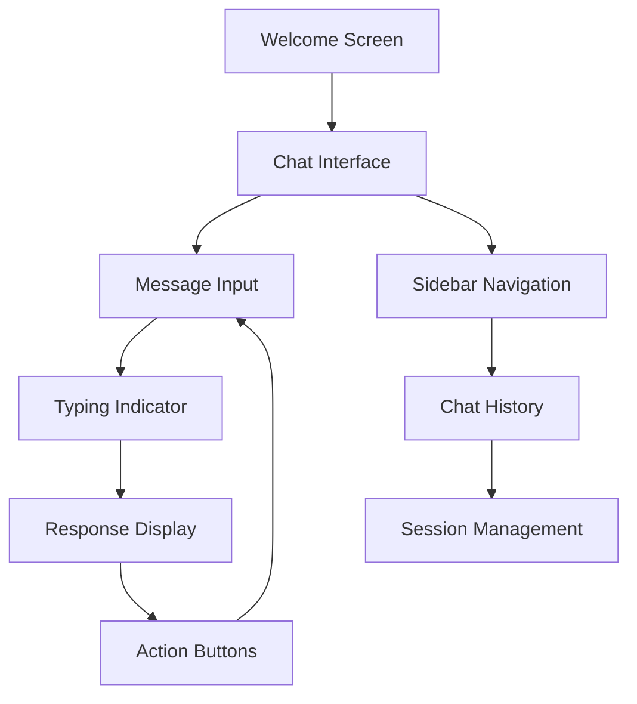

# Apple Human Interface Design System

## Chatbot UI Transformation Specification

## 1. Product Overview

Transformation of the existing chatbot interface into a refined, modern Apple-style UI that embodies Apple's signature design language, precision, and aesthetic excellence. The redesign focuses on glassmorphism effects, subtle depth, smooth animations, and the iconic Apple color palette to create an intuitive and visually stunning user experience.

* **Primary Goal**: Implement Apple's Human Interface Guidelines with frosted-glass effects, precise typography, and physics-based animations

* **Target Experience**: Premium, elegant, and highly responsive interface that feels native to Apple's ecosystem

## 2. Core Features

### 2.1 Design Language Principles

#### Color Theory & Palette

* **Primary Colors**: SF Symbols palette with neutral whites (#FAFAFA, #F5F5F7), soft grays (#1D1D1F, #86868B)

* **Accent Colors**:

  * Aqua: #007AFF (primary interactive)

  * Blue: #0071E3 (secondary actions)

  * Green: #30D158 (success states)

  * Lavender: #AF52DE (tertiary accents)

* **Depth & Shadows**: Soft drop shadows (0 4px 20px rgba(0,0,0,0.08)), frosted-glass blur effects

* **Interactive States**: Subtle color shifts with 200ms ease-out transitions

#### Typography System

* **Primary Font**: San Francisco Pro Display/Text (-apple-system, BlinkMacSystemFont)

* **Hierarchy**:

  * Headlines: 28px/32px, -0.025em tracking, 600 weight

  * Body: 16px/24px, 0 tracking, 400 weight

  * Captions: 12px/16px, 0.025em tracking, 500 weight

* **Text Colors**: #1D1D1F (primary), #86868B (secondary), #FFFFFF (on-dark)

#### Layout & Spacing

* **Grid System**: 8pt base unit (8px, 16px, 24px, 32px, 40px, 48px)

* **Border Radius**: 12px (small), 16px (medium), 20px (large), 24px (extra-large)

* **Container Padding**: 24px (mobile), 32px (tablet), 40px (desktop)

* **Element Spacing**: 16px (tight), 24px (normal), 32px (loose)

### 2.2 Component Specifications

#### Chat Bubbles

* **User Messages**:

  * Background: Linear gradient from #007AFF to #0051D5

  * Border radius: 20px (top-left: 4px for tail effect)

  * Shadow: 0 2px 12px rgba(0,122,255,0.25)

  * Backdrop filter: blur(20px) saturate(180%)

* **Assistant Messages**:

  * Background: rgba(255,255,255,0.85)

  * Border: 1px solid rgba(255,255,255,0.2)

  * Border radius: 20px (top-right: 4px for tail effect)

  * Shadow: 0 4px 20px rgba(0,0,0,0.08)

  * Backdrop filter: blur(20px) saturate(180%)

#### Buttons

* **Primary**: Pill-shaped (height: 44px), gradient background, white text

* **Secondary**: Pill-shaped, transparent background, colored border

* **Hover States**: Scale(1.02), glow effect (0 0 20px rgba(color,0.3))

* **Active States**: Scale(0.98), reduced opacity (0.8)

* **Transitions**: 200ms cubic-bezier(0.4, 0.0, 0.2, 1)

#### Cards & Containers

* **Background**: rgba(255,255,255,0.8)

* **Border**: 1px solid rgba(255,255,255,0.2)

* **Border Radius**: 16px

* **Shadow**: 0 8px 32px rgba(0,0,0,0.12)

* **Backdrop Filter**: blur(20px) saturate(180%)

### 2.3 Animation Specifications

#### Physics-Based Transitions

* **Ease Functions**: cubic-bezier(0.4, 0.0, 0.2, 1) for standard, cubic-bezier(0.25, 0.46, 0.45, 0.94) for bounce

* **Duration Scale**: 150ms (micro), 200ms (standard), 300ms (complex), 500ms (page transitions)

* **Chat Bubble Entry**: fadeIn + slideUp (y: 12px to 0), stagger delay: 80ms

* **Hover Micro-interactions**: scale(1.02), glow, color shift

#### Loading & System States

* **Typing Indicator**: Pulsing dots with 1.2s cycle, 150ms stagger

* **Message Loading**: Skeleton shimmer with 1.5s cycle

* **Page Transitions**: Slide + fade with momentum scrolling

## 3. Core Process

### User Interaction Flow

1. **Landing**: Welcome screen with subtle animations and suggestion cards
2. **Chat Initiation**: Smooth transition to chat interface with sidebar slide-in
3. **Message Exchange**: Real-time typing indicators, smooth bubble animations
4. **Session Management**: Sidebar chat history with edit/delete micro-interactions
5. **Responsive Adaptation**: Seamless mobile/desktop layout transitions



## 4. User Interface Design

### 4.1 Design Style

* **Primary Colors**: #007AFF (System Blue), #FFFFFF (Pure White)

* **Secondary Colors**: #F5F5F7 (Light Gray), #1D1D1F (Dark Gray)

* **Accent Colors**: #30D158 (Green), #AF52DE (Purple), #FF9500 (Orange)

* **Button Style**: Pill-shaped with 22px border-radius, subtle shadows

* **Font**: San Francisco Pro (-apple-system fallback)

* **Layout**: Card-based with 16px grid system, glassmorphism effects

* **Icons**: SF Symbols style with 1.5px stroke weight

### 4.2 Page Design Overview

| Page Name        | Module Name      | UI Elements                                                                                  |
| ---------------- | ---------------- | -------------------------------------------------------------------------------------------- |
| Chat Interface   | Main Container   | Frosted glass background (rgba(255,255,255,0.8)), backdrop-filter: blur(20px), subtle border |
| Sidebar          | Navigation Panel | Gradient background (from-gray-50/95 to-white/95), smooth slide animations, hover states     |
| Chat Bubbles     | Message Display  | User: Blue gradient (#007AFF to #0051D5), Assistant: White glass (rgba(255,255,255,0.85))    |
| Input Area       | Message Composer | White background with subtle shadow, rounded corners (20px), focus ring                      |
| Action Buttons   | Quick Actions    | Pill-shaped, colored borders, hover glow effects, scale animations                           |
| Typing Indicator | Loading State    | Pulsing dots with blue gradient, smooth fade in/out                                          |

### 4.3 Responsiveness

* **Approach**: Mobile-first with progressive enhancement

* **Breakpoints**: 375px (mobile), 768px (tablet), 1024px (desktop)

* **Touch Optimization**: 44px minimum touch targets, swipe gestures

* **Adaptive Layout**: Sidebar collapses to overlay on mobile, maintains glassmorphism

* **Performance**: Hardware-accelerated animations, optimized blur effects

## 5. Technical Implementation

### 5.1 Enhanced Tailwind Configuration

```javascript
// Apple-specific color tokens
colors: {
  apple: {
    blue: '#007AFF',
    gray: {
      50: '#FAFAFA',
      100: '#F5F5F7',
      900: '#1D1D1F'
    },
    green: '#30D158',
    purple: '#AF52DE'
  }
}
```

### 5.2 Glassmorphism Utilities

```css
.glass {
  background: rgba(255, 255, 255, 0.8);
  backdrop-filter: blur(20px) saturate(180%);
  border: 1px solid rgba(255, 255, 255, 0.2);
}

.glass-dark {
  background: rgba(0, 0, 0, 0.4);
  backdrop-filter: blur(20px) saturate(180%);
  border: 1px solid rgba(255, 255, 255, 0.1);
}
```

### 5.3 Animation Presets

```css
.apple-transition {
  transition: all 200ms cubic-bezier(0.4, 0.0, 0.2, 1);
}

.apple-hover:hover {
  transform: scale(1.02);
  box-shadow: 0 0 20px rgba(0, 122, 255, 0.3);
}
```

### 5.4 Component Architecture

* **Modular Design**: Reusable components with consistent styling

* **Theme Support**: Light/dark mode with CSS custom properties

* **Performance**: Optimized animations with transform/opacity

* **Accessibility**: WCAG 2.1 AA compliance with proper contrast ratios

