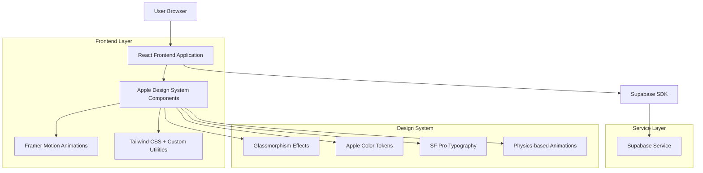

# Apple UI Technical Architecture

## Chatbot Interface Implementation Guide

## 1. Architecture Design



## 2. Technology Description

* **Frontend**: React\@18 + TypeScript + Tailwind CSS\@3 + Framer Motion\@10

* **Design System**: Custom Apple HIG implementation with glassmorphism utilities

* **Animation Engine**: Framer Motion with physics-based transitions

* **Styling**: Enhanced Tailwind configuration with Apple design tokens

* **Backend**: Supabase (existing integration maintained)

## 3. Route Definitions

| Route            | Purpose               | Apple Design Elements                                      |
| ---------------- | --------------------- | ---------------------------------------------------------- |
| /                | Main chat interface   | Glassmorphism sidebar, frosted chat area, Apple typography |
| /chat/:sessionId | Specific chat session | Smooth transitions, message bubble animations              |
| /settings        | User preferences      | Apple-style form controls, toggle switches                 |
| /help            | Documentation         | Card-based layout with subtle shadows                      |

## 4. Component Architecture

### 4.1 Core Design System Components

#### AppleButton Component

```typescript
interface AppleButtonProps {
  variant: 'primary' | 'secondary' | 'ghost';
  size: 'sm' | 'md' | 'lg';
  glowColor?: string;
  children: React.ReactNode;
}
```

**Styling Specifications**:

* Primary: Blue gradient background (#007AFF to #0051D5)

* Secondary: Transparent with colored border

* Ghost: No background, hover glow effect

* Border radius: 22px (pill shape)

* Hover: scale(1.02) + glow effect

* Active: scale(0.98) + opacity(0.8)

#### GlassContainer Component

```typescript
interface GlassContainerProps {
  blur?: number; // Default: 20px
  opacity?: number; // Default: 0.8
  border?: boolean; // Default: true
  shadow?: 'sm' | 'md' | 'lg'; // Default: 'md'
}
```

**CSS Implementation**:

```css
.glass-container {
  background: rgba(255, 255, 255, var(--glass-opacity));
  backdrop-filter: blur(var(--glass-blur)) saturate(180%);
  border: 1px solid rgba(255, 255, 255, 0.2);
  box-shadow: 0 8px 32px rgba(0, 0, 0, 0.12);
}
```

#### ChatBubble Component

```typescript
interface ChatBubbleProps {
  message: ChatMessage;
  isUser: boolean;
  animationDelay?: number;
}
```

**Animation Specifications**:

* Entry: fadeIn + slideUp (y: 12px → 0)

* Duration: 400ms cubic-bezier(0.4, 0.0, 0.2, 1)

* Stagger delay: 80ms between messages

* Hover: subtle scale(1.01) for interactive elements

### 4.2 Enhanced Tailwind Configuration

```javascript
module.exports = {
  theme: {
    extend: {
      colors: {
        apple: {
          blue: {
            DEFAULT: '#007AFF',
            dark: '#0051D5',
            light: '#40A9FF'
          },
          gray: {
            50: '#FAFAFA',
            100: '#F5F5F7',
            200: '#E5E5E7',
            300: '#D1D1D6',
            400: '#C7C7CC',
            500: '#AEAEB2',
            600: '#8E8E93',
            700: '#636366',
            800: '#48484A',
            900: '#1D1D1F'
          },
          green: '#30D158',
          purple: '#AF52DE',
          orange: '#FF9500',
          red: '#FF3B30'
        }
      },
      fontFamily: {
        'sf-pro': ['-apple-system', 'BlinkMacSystemFont', 'SF Pro Display', 'SF Pro Text'],
        'sf-display': ['-apple-system', 'BlinkMacSystemFont', 'SF Pro Display'],
        'sf-text': ['-apple-system', 'BlinkMacSystemFont', 'SF Pro Text']
      },
      fontSize: {
        'apple-title1': ['28px', { lineHeight: '34px', letterSpacing: '-0.025em', fontWeight: '700' }],
        'apple-title2': ['22px', { lineHeight: '28px', letterSpacing: '-0.025em', fontWeight: '700' }],
        'apple-title3': ['20px', { lineHeight: '25px', letterSpacing: '-0.025em', fontWeight: '600' }],
        'apple-headline': ['17px', { lineHeight: '22px', letterSpacing: '-0.025em', fontWeight: '600' }],
        'apple-body': ['17px', { lineHeight: '22px', letterSpacing: '0', fontWeight: '400' }],
        'apple-callout': ['16px', { lineHeight: '21px', letterSpacing: '0', fontWeight: '400' }],
        'apple-subhead': ['15px', { lineHeight: '20px', letterSpacing: '0', fontWeight: '400' }],
        'apple-footnote': ['13px', { lineHeight: '18px', letterSpacing: '0', fontWeight: '400' }],
        'apple-caption1': ['12px', { lineHeight: '16px', letterSpacing: '0', fontWeight: '400' }],
        'apple-caption2': ['11px', { lineHeight: '13px', letterSpacing: '0.025em', fontWeight: '400' }]
      },
      spacing: {
        '4.5': '18px',
        '18': '72px',
        '22': '88px'
      },
      borderRadius: {
        'apple-sm': '8px',
        'apple-md': '12px',
        'apple-lg': '16px',
        'apple-xl': '20px',
        'apple-2xl': '24px',
        'apple-pill': '22px'
      },
      boxShadow: {
        'apple-sm': '0 2px 8px rgba(0, 0, 0, 0.04)',
        'apple-md': '0 4px 16px rgba(0, 0, 0, 0.08)',
        'apple-lg': '0 8px 32px rgba(0, 0, 0, 0.12)',
        'apple-glow-blue': '0 0 20px rgba(0, 122, 255, 0.3)',
        'apple-glow-green': '0 0 20px rgba(48, 209, 88, 0.3)',
        'apple-glow-purple': '0 0 20px rgba(175, 82, 222, 0.3)'
      },
      animation: {
        'apple-bounce': 'apple-bounce 0.6s cubic-bezier(0.25, 0.46, 0.45, 0.94)',
        'apple-slide-up': 'apple-slide-up 0.4s cubic-bezier(0.4, 0.0, 0.2, 1)',
        'apple-fade-in': 'apple-fade-in 0.3s ease-out',
        'apple-pulse': 'apple-pulse 1.2s cubic-bezier(0.4, 0.0, 0.2, 1) infinite'
      },
      keyframes: {
        'apple-bounce': {
          '0%': { transform: 'scale(0.95)', opacity: '0' },
          '50%': { transform: 'scale(1.02)' },
          '100%': { transform: 'scale(1)', opacity: '1' }
        },
        'apple-slide-up': {
          '0%': { transform: 'translateY(12px)', opacity: '0' },
          '100%': { transform: 'translateY(0)', opacity: '1' }
        },
        'apple-fade-in': {
          '0%': { opacity: '0' },
          '100%': { opacity: '1' }
        },
        'apple-pulse': {
          '0%, 100%': { opacity: '0.6', transform: 'scale(1)' },
          '50%': { opacity: '1', transform: 'scale(1.3)' }
        }
      }
    }
  },
  plugins: [
    function({ addUtilities }) {
      addUtilities({
        '.glass': {
          'background': 'rgba(255, 255, 255, 0.8)',
          'backdrop-filter': 'blur(20px) saturate(180%)',
          'border': '1px solid rgba(255, 255, 255, 0.2)'
        },
        '.glass-dark': {
          'background': 'rgba(0, 0, 0, 0.4)',
          'backdrop-filter': 'blur(20px) saturate(180%)',
          'border': '1px solid rgba(255, 255, 255, 0.1)'
        },
        '.apple-transition': {
          'transition': 'all 200ms cubic-bezier(0.4, 0.0, 0.2, 1)'
        },
        '.apple-hover': {
          '&:hover': {
            'transform': 'scale(1.02)',
            'box-shadow': '0 0 20px rgba(0, 122, 255, 0.3)'
          }
        }
      })
    }
  ]
}
```

## 5. Animation System

### 5.1 Framer Motion Variants

```typescript
// Message animation variants
export const messageVariants = {
  hidden: {
    opacity: 0,
    y: 12,
    scale: 0.98
  },
  visible: (index: number) => ({
    opacity: 1,
    y: 0,
    scale: 1,
    transition: {
      delay: index * 0.08,
      duration: 0.4,
      ease: [0.4, 0.0, 0.2, 1]
    }
  }),
  exit: {
    opacity: 0,
    y: -12,
    scale: 0.98,
    transition: {
      duration: 0.2
    }
  }
};

// Button interaction variants
export const buttonVariants = {
  idle: { scale: 1 },
  hover: { 
    scale: 1.02,
    transition: { duration: 0.2 }
  },
  tap: { 
    scale: 0.98,
    transition: { duration: 0.1 }
  }
};

// Typing indicator variants
export const typingVariants = {
  animate: {
    scale: [1, 1.3, 1],
    opacity: [0.6, 1, 0.6],
    transition: {
      duration: 1.2,
      repeat: Infinity,
      ease: [0.4, 0.0, 0.2, 1]
    }
  }
};
```

### 5.2 Performance Optimizations

* **Hardware Acceleration**: Use transform and opacity for animations

* **Reduced Motion**: Respect `prefers-reduced-motion` media query

* **Efficient Blur**: Optimize backdrop-filter usage for performance

* **Lazy Loading**: Implement intersection observer for off-screen animations

## 6. Responsive Design Implementation

### 6.1 Breakpoint Strategy

```typescript
const breakpoints = {
  sm: '375px',  // iPhone SE
  md: '768px',  // iPad
  lg: '1024px', // iPad Pro
  xl: '1280px', // Desktop
  '2xl': '1536px' // Large Desktop
};
```

### 6.2 Mobile Adaptations

* **Sidebar**: Slides in from left as overlay on mobile

* **Chat Bubbles**: Reduced padding, optimized for thumb interaction

* **Input Area**: Sticky positioning, safe area insets

* **Touch Targets**: Minimum 44px height for all interactive elements

### 6.3 Accessibility Features

* **Focus Management**: Visible focus rings with Apple-style styling

* **Screen Reader**: Proper ARIA labels and semantic markup

* **Keyboard Navigation**: Full keyboard accessibility

* **Color Contrast**: WCAG 2.1 AA compliance (4.5:1 minimum)

* **Reduced Motion**: Alternative animations for motion-sensitive users

## 7. Implementation Phases

### Phase 1: Foundation (Week 1)

* Enhanced Tailwind configuration

* Core design system components

* Typography and color system

### Phase 2: Components (Week 2)

* Chat bubble redesign

* Button system implementation

* Glassmorphism containers

### Phase 3: Animations (Week 3)

* Framer Motion integration

* Physics-based transitions

* Micro-interactions

### Phase 4: Polish (Week 4)

* Performance optimization

* Accessibility audit

* Cross-browser testing

* Mobile responsiveness

## 8. Quality Assurance

### 8.1 Performance Metrics

* **First Contentful Paint**: < 1.5s

* **Largest Contentful Paint**: < 2.5s

* **Cumulative Layout Shift**: < 0.1

* **Animation Frame Rate**: 60fps

### 8.2 Browser Support

* **Modern Browsers**: Chrome 90+, Safari 14+, Firefox 88+, Edge 90+

* **Backdrop Filter**: Graceful degradation for unsupported browsers

* **CSS Grid**: Flexbox fallbacks where needed

### 8.3 Testing Strategy

* **Unit Tests**: Component functionality and props

* **Visual Regression**: Automated screenshot comparison

* **Accessibility**: axe-core integration

* **Performance**: Lighthouse CI integration

